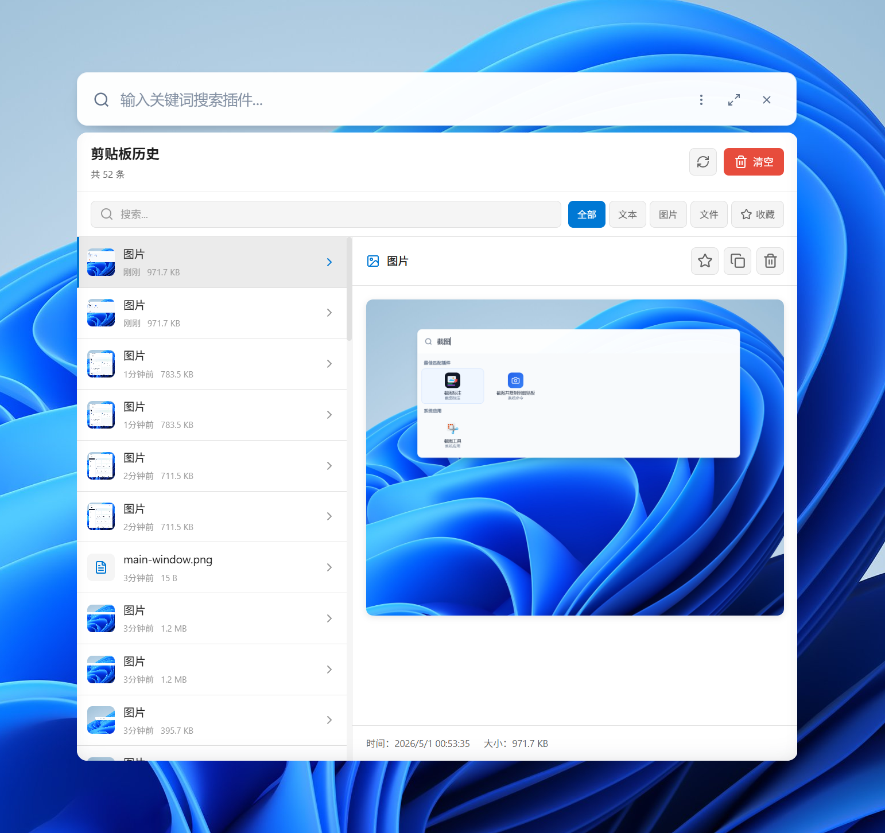
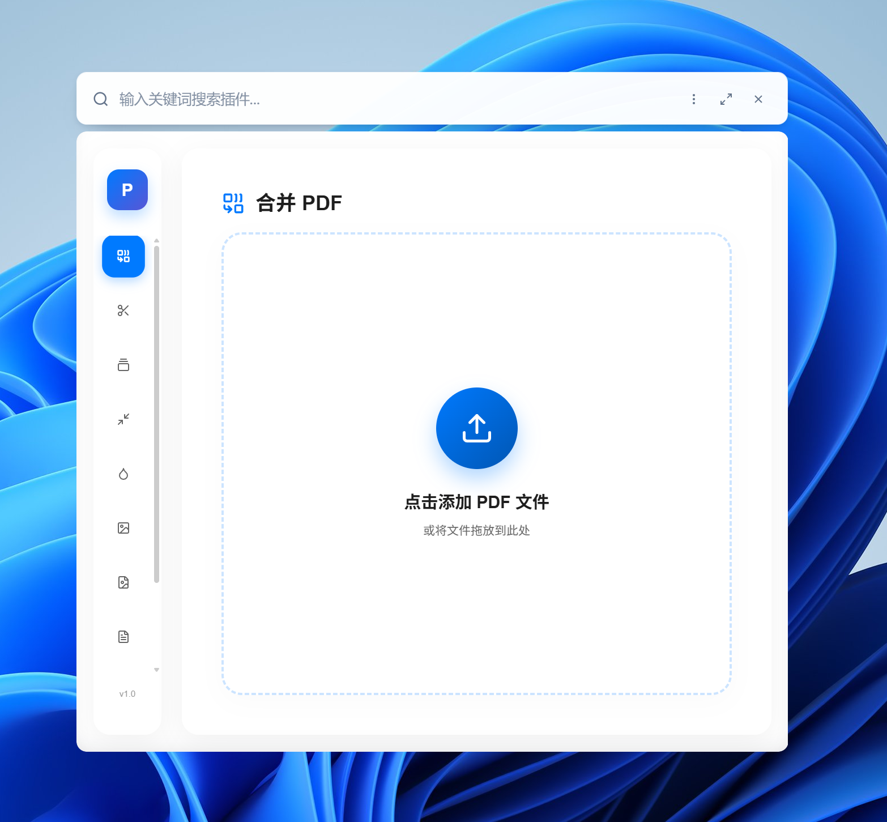
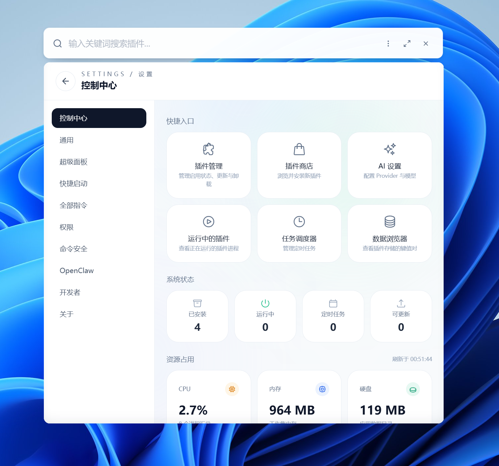
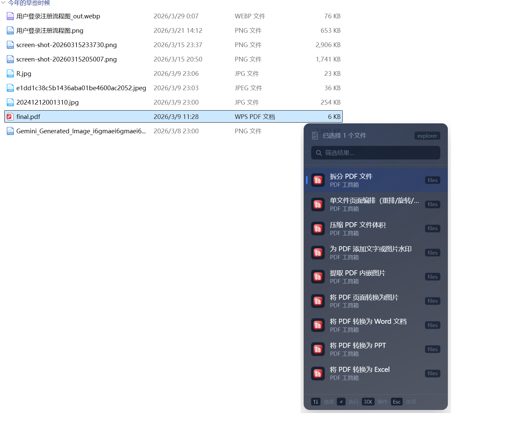
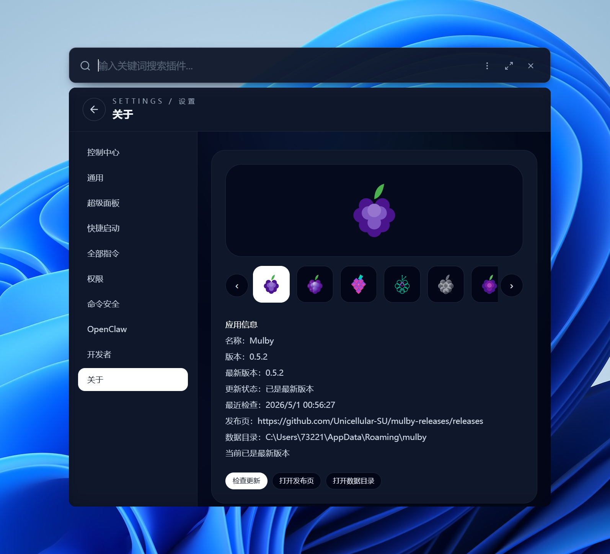

# Mulby


跨平台插件式效率工具箱（Electron Desktop App）

> 声明：本项目完全由AI编码完成。

## 开发背景

最初开发 Mulby，是因为实在无法忍受 utools 免费会员最多只能用 10 个插件的限制。然后发现现在AI这么强，所以索性自己开搞，结果一做就停不下来（然而AI上的消费已经够买几个永久会员了...）。从一月项目立项一路肝到现在，快做完却发现已经有了优秀的开源项目 ztools……说到底这属于典型的“重复造轮子”。但既然已经启动，也就一鼓作气走到底。

开发过程中参考了 [ztools](https://github.com/ZToolsCenter/ZTools)、[rubick](https://github.com/rubickCenter/rubick) 等出色项目的很多实现细节，在这里也感谢两位大佬的无私开源！Mulby 的整体理念和 utools/ztools/rubick 并无二致，都是全局启动器 + 插件生态，只是实现方式略有区分。“本地大一统”，支持各种乱七八糟的需求和插件能力，目标是尽量全面。也欢迎大家探索和吐槽；更欢迎编写插件一起来共建生态体系——我还特意做了插件 skill（没错，插件也全部由 AI 生成，我已经彻底不会古法编程了）。

> PS: Linux我没测试，不确定是否正常，欢迎大佬 PR

## 项目简介

Mulby /ˈmʌlbi/ 这个名字源自英文 “Mulberry” 的变体，意为桑葚 —— 就像一颗颗桑葚聚合成一整串果实，Mulby 通过插件机制，将各类功能像桑葚颗粒一样聚集在一起，形成强大的桌面效率工具箱。它面向开发者与效率用户，通过全局快捷键唤起，支持插件搜索与执行、插件商店安装、AI 能力编排与任务调度。

## 当前能力

- 全局启动器与系统入口：支持全局快捷键唤起、托盘菜单、自定义快捷键、引导流程、设置中心、插件商店、插件管理、后台插件、任务调度、日志中心、AI 设置、超级面板等入口；内置锁屏/睡眠/重启/关机/注销、截图、取色、打开 URL、打开用户数据/日志/插件目录、重启/退出应用、清空剪贴板等系统命令。
- 搜索与触发：支持插件关键字、正则、文本粘贴、文件/图片附件、前台窗口上下文等触发方式；搜索结果支持拼音匹配、最近使用、固定/隐藏偏好，并可同时检索本机应用与文件（Windows/macOS/Linux 分平台实现）。
- 插件运行时：Node.js 插件通过 Host Worker + API Bridge 运行，支持附着面板、独立窗口、常驻会话、后台/持久化插件、窗口恢复与资源守护；插件可声明动态指令、命令快捷键、AI Tools、预截图能力、窗口参数、资源限制与命令执行权限。
- 插件 API：通过 `window.mulby` 与插件 Host API 提供剪贴板、剪贴板历史、通知、存储、文件系统、Shell、HTTP/Network、窗口、菜单、托盘、主题、权限、系统信息、屏幕/区域截图、输入、媒体、TTS、Sharp、FFmpeg、InBrowser、插件间消息、动态功能注册等能力。
- 插件安装与商店：支持 `.inplugin` 包安装、在线 URL 安装、安装/更新/批量更新状态识别、多仓库源管理、索引加载与来源优先级合并；商店下载仅允许 `HTTPS` 或本地 `HTTP(localhost/127.0.0.1)`，支持 `sha256` 完整性校验与安装来源元数据记录。
- AI 能力中心：支持多 Provider/多实例配置（OpenAI、OpenAI Responses、Anthropic、Gemini/Google、DeepSeek、OpenRouter、Azure/OpenAI-compatible、New API、Cherryin、Ollama、自定义等）、模型拉取/管理/能力标注、连接测试、流式输出、工具调用、附件上传、Token 估算、图片生成/编辑。
- MCP 与 Skills：支持作为 MCP Client 连接 `stdio`、`SSE`、`streamableHttp` 服务并管理工具启用/自动批准策略；支持安装和管理 AI Skills（本地目录、zip、npx、内置/系统 skill），并可按请求解析 Skills、MCP 与工具作用域。Mulby 也可作为带 Bearer Token 的 MCP Server，将插件声明的 AI Tools 暴露给 Claude Desktop、Cursor、Cherry Studio 等外部客户端（含 stdio bridge）。
- AI 工具与治理：内置文件系统、Patch、HTTP、Git、脚本执行、Web Search、运行时能力 introspection 等工具能力；Web Search 支持本地搜索引擎、Tavily、Jina 与自定义 API Provider；提供插件工具开关、能力授权策略、文件/HTTP/Git/脚本范围限制和命令执行审计。
- 自动化与系统集成：任务调度支持一次性、延迟、重复任务、重试、超时、执行历史与后台插件自动拉起；提供超级面板（鼠标/键盘/双击触发、应用屏蔽、剪贴板轮询、即时翻译）、剪贴板历史、深链接 `mulby://`、自动更新中心、OpenClaw Node 连接与安全策略。

## 架构概览

- `src/main`：主进程、IPC、插件系统、AI、调度器、设置/托盘/日志服务。
- `src/preload`：通过 `window.mulby` 暴露受控 API。
- `src/renderer`：React 前端（主界面、设置中心、插件管理、插件商店、AI 设置等）。
- [`mulby-cli`](https://github.com/Unicellular-SU/mulby-cli)：插件开发 CLI（创建、调试、构建、打包）。
- [`mulby-skills`](https://github.com/Unicellular-SU/mulby-skills)：面向 AI 编码工具的 Mulby 开发技能与参考资料。

## 界面预览

### 主窗口与搜索


### 插件生态






### 设置与超级面板







## 快速开始

```bash
# 安装依赖（主应用）
pnpm install

# 启动开发模式（Electron + Vite）
pnpm run electron:dev

# 构建桌面应用
pnpm run electron:build
```

## 常用脚本

```bash
# 主应用校验：类型检查 + Lint + 单测 + 构建烟测
pnpm run verify

# 仓库校验：主应用
pnpm run verify:repo
```

## 插件开发入口

- [Mulby 官方插件仓库](https://github.com/Unicellular-SU/mulby-plugins) (订阅链接： `https://raw.githubusercontent.com/Unicellular-SU/mulby-plugins/refs/heads/main/plugins.json`)
- [Mulby CLI](https://github.com/Unicellular-SU/mulby-cli)
- [Mulby Skills](https://github.com/Unicellular-SU/mulby-skills)

## 参与贡献

欢迎提交 Issue、PR，也欢迎一起完善插件生态。比较适合贡献的方向包括：

- 编写插件，并提交到官方插件仓库。
- 完善 Mulby CLI 模板、插件 API 文档与开发示例。
- 补充 Windows/macOS/Linux 的兼容性测试与问题修复。
- 改进 AI Provider、MCP、Skills、Web Search、超级面板等能力。

开发前建议先运行 `pnpm install`，提交前执行 `pnpm run verify`。

## 许可证

[MIT License](./LICENSE)

**再次鸣谢 [uTools](https://www.u-tools.cn/)、[zTools](https://github.com/threezh1/zTools)、[Rubick](https://github.com/clouDr-f2e/rubick) 等优秀工具的启发与借鉴。**
