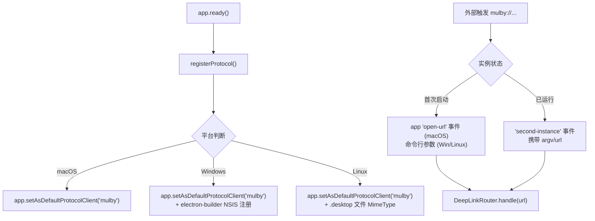
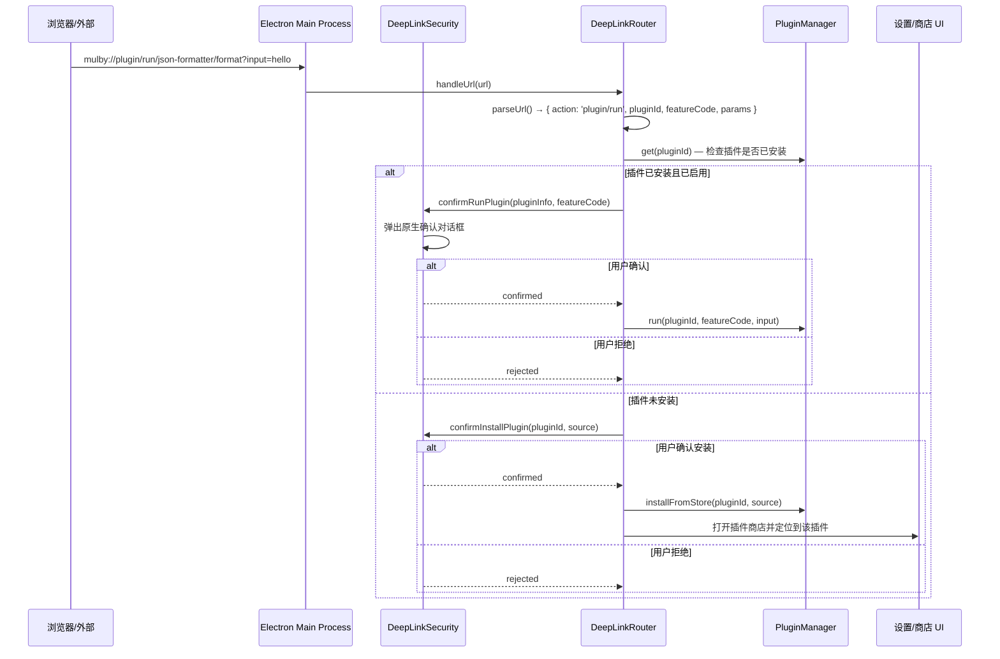
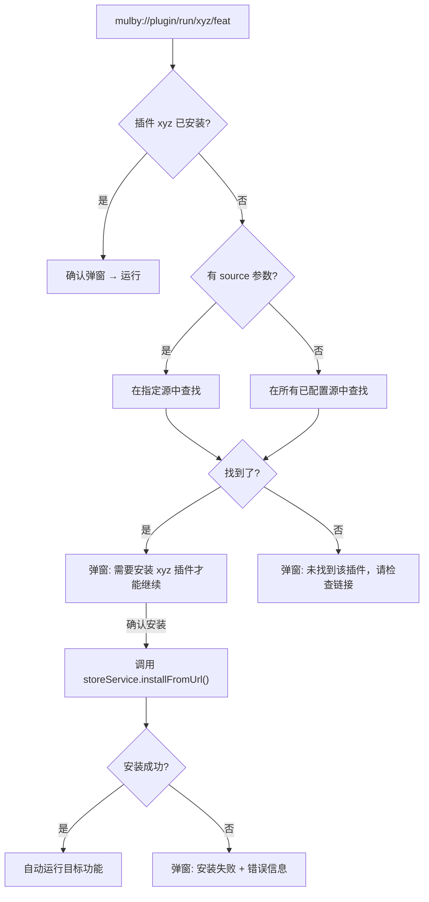

# Mulby 启动链接（Deep Link）设计方案

## 背景

启动链接是桌面应用的重要分发与互联能力。通过自定义 URL Protocol（如 `mulby://`），可以实现：
- 🌐 **浏览器唤起应用** — 网页一键启动 Mulby 并执行插件
- 📤 **插件分享** — 生成可分享的链接，发送给其他用户
- 📦 **一键安装** — 通过链接直接触发插件安装流程
- 🔗 **外部集成** — 其他应用可通过链接调用 Mulby 特定功能

> [!IMPORTANT]
> 当前项目完全没有 Deep Link 相关基础设施（无 `setAsDefaultProtocolClient` 调用、无 `open-url` 事件监听、electron-builder 配置中也无 protocol 注册）。这是一个从零开始的新特性。

---

## User Review Required

> [!IMPORTANT]
> **协议名称确认**：方案使用 `mulby` 作为协议名（`mulby://...`），这与 appId `com.mulby.app` 一致。如需使用其他名称请告知。

> [!WARNING]
> **安全弹窗策略**：方案默认对所有外部唤起的操作弹出用户确认窗口（类似 Slack / VS Code 的行为）。如果你希望某些操作跳过确认（如仅打开设置），请说明策略偏好。

> [!IMPORTANT]
> **Web 落地页**：方案包含一个可选的 Web 落地页 HTML 模板（用于检测已安装并自动唤起，未安装则引导下载）。是否现在实现，还是作为后续阶段？

---

## 1. URL 路由设计

### 1.1 协议格式

```
mulby://<action>/<target>[?params]
```

### 1.2 完整路由表

| 路由 | 说明 | 示例 |
|------|------|------|
| `mulby://plugin/run/<pluginId>/<featureCode>` | 运行已安装插件 | `mulby://plugin/run/json-formatter/format` |
| `mulby://plugin/install?id=<pluginId>&source=<sourceUrl>` | 安装/更新插件 | `mulby://plugin/install?id=json-formatter&source=https://store.mulby.app/index.json` |
| `mulby://plugin/view/<pluginId>` | 查看插件详情（在商店/管理器中打开） | `mulby://plugin/view/json-formatter` |
| `mulby://settings[/<section>]` | 打开设置页 | `mulby://settings/ai-settings` |
| `mulby://search?q=<query>` | 打开搜索框并填入查询 | `mulby://search?q=json` |
| `mulby://store` | 打开插件商店 | `mulby://store` |

### 1.3 路由参数说明

#### `plugin/run` 参数
| 参数 | 必需 | 说明 |
|------|------|------|
| `pluginId` | ✅ | 路径参数，插件 ID |
| `featureCode` | ✅ | 路径参数，功能入口 code |
| `input` | ❌ | 查询参数，初始输入文本（URL encoded） |

#### `plugin/install` 参数
| 参数 | 必需 | 说明 |
|------|------|------|
| `id` | ✅ | 插件 ID |
| `source` | ❌ | 插件商店源 URL（未提供时从已配置的源中搜索） |
| `download` | ❌ | 直接下载 URL（跳过源查找，直接安装 .inplugin） |
| `name` | ❌ | 插件显示名称（用于确认弹窗展示） |
| `publisher` | ❌ | 发布者名称（用于确认弹窗展示） |

---

## 2. 核心架构设计

### 2.1 系统级协议注册



### 2.2 模块分层

```
src/main/services/deep-link.ts     ← 协议注册 & URL 路由核心
src/main/services/deep-link-security.ts  ← 安全确认弹窗
src/shared/types/deep-link.ts      ← 类型定义
```

### 2.3 核心流程



---

## 3. 安全模型

### 3.1 设计原则

> [!CAUTION]
> Deep Link 是**外部攻击面**。任何通过 URL 触发的操作都必须经过用户明确同意。

| 安全措施 | 说明 |
|----------|------|
| **用户确认弹窗** | 所有外部触发的操作（运行插件、安装插件）都弹出原生 `dialog.showMessageBox` 确认 |
| **URL 校验** | 严格校验 URL 格式，拒绝畸形/过长 URL |
| **来源标记** | 所有通过 Deep Link 安装的插件在 `.mulby-install.json` 中标记 `installSource: 'deep-link'` |
| **速率限制** | 同一操作 5 秒内不重复弹窗（防 pop-up bombing） |
| **信任白名单（可选）** | 用户可在设置中标记"信任此插件的外部唤起"跳过确认 |

### 3.2 确认对话框设计

```
┌─────────────────────────────────────────────────┐
│  ⚡ Mulby — 外部请求                             │
│                                                   │
│  外部应用请求运行插件：                            │
│                                                   │
│  📦 JSON 格式化 (json-formatter)                  │
│  🔧 功能: format                                  │
│  📝 输入: "hello world"                            │
│                                                   │
│  ╔═══════════════╗  ╔══════════╗                  │
│  ║   允许并运行   ║  ║   取消   ║                  │
│  ╚═══════════════╝  ╚══════════╝                  │
│                                                   │
│  □ 信任此插件的外部唤起                             │
└─────────────────────────────────────────────────┘
```

### 3.3 插件未安装时的降级流程



---

## 4. Proposed Changes

### 基础设施层（Deep Link 核心）

---

#### [NEW] [deep-link.ts](file:///Users/su/workspace/mulby/src/shared/types/deep-link.ts)

Deep Link 类型定义文件。

```typescript
export type DeepLinkAction =
  | 'plugin/run'
  | 'plugin/install'
  | 'plugin/view'
  | 'settings'
  | 'search'
  | 'store'

export interface DeepLinkRoute {
  action: DeepLinkAction
  pluginId?: string
  featureCode?: string
  params: Record<string, string>
}

export interface DeepLinkConfirmPayload {
  action: DeepLinkAction
  title: string
  message: string
  detail?: string
  pluginId?: string
  pluginName?: string
}

export interface DeepLinkHandleResult {
  success: boolean
  action: DeepLinkAction
  error?: string
  /** 是否经过用户确认 */
  confirmed?: boolean
}
```

---

#### [NEW] [deep-link.ts](file:///Users/su/workspace/mulby/src/main/services/deep-link.ts)

核心路由模块。职责：
- URL 解析与校验
- 路由分发到 PluginManager / SystemPageWindowManager
- 协调确认弹窗

```typescript
// 核心结构伪代码
export class DeepLinkRouter {
  constructor(
    private pluginManager: PluginManager,
    private storeService: PluginStoreService,
    private security: DeepLinkSecurity,
    private openSystemPage: (page: string) => void,
    private showMainWindow: () => void
  )

  /** 处理传入的 deep link URL */
  async handleUrl(url: string): Promise<DeepLinkHandleResult>

  /** 解析 URL 为路由对象 */
  private parseUrl(url: string): DeepLinkRoute | null

  /** 处理 plugin/run 路由 */
  private async handlePluginRun(route: DeepLinkRoute): Promise<...>

  /** 处理 plugin/install 路由 */
  private async handlePluginInstall(route: DeepLinkRoute): Promise<...>

  /** 处理 plugin/view 路由 */
  private async handlePluginView(route: DeepLinkRoute): Promise<...>

  /** 处理 settings 路由 */
  private handleSettings(route: DeepLinkRoute): ...

  /** 处理 search 路由 */
  private handleSearch(route: DeepLinkRoute): ...

  /** 从商店源中查找插件信息 */
  private async findPluginInStore(pluginId: string, sourceUrl?: string): Promise<...>
}
```

---

#### [NEW] [deep-link-security.ts](file:///Users/su/workspace/mulby/src/main/services/deep-link-security.ts)

安全确认模块。职责：
- 用户确认对话框（复用 `ui-dialog-service.ts` 风格）
- 速率限制（防 pop-up bombing）
- 信任白名单管理

---

### 主进程集成层

---

#### [MODIFY] [index.ts](file:///Users/su/workspace/mulby/src/main/index.ts)

主进程入口文件变更：

1. **协议注册**：在 `app.ready()` 之前调用 `app.setAsDefaultProtocolClient('mulby')`
2. **macOS `open-url` 事件**：注册 `app.on('open-url', ...)` 事件处理
3. **`second-instance` 增强**：修改 `handleSecondInstance` 函数，从 `argv` 中提取 URL
4. **DeepLinkRouter 初始化**：在 `createWindow()` 后实例化路由器

关键变更点：

```typescript
// === 协议注册（在 requestSingleInstanceLock 之前） ===
if (!app.isPackaged) {
  // 开发模式需要传入可执行文件路径
  app.setAsDefaultProtocolClient('mulby', process.execPath, ['.'])
} else {
  app.setAsDefaultProtocolClient('mulby')
}

// === macOS open-url 事件 ===
app.on('open-url', (event, url) => {
  event.preventDefault()
  if (deepLinkRouter) {
    void deepLinkRouter.handleUrl(url)
  } else {
    pendingDeepLinkUrl = url  // 缓存，等初始化完成后处理
  }
})

// === 增强 handleSecondInstance ===
const handleSecondInstance = (_event: Event, argv: string[]) => {
  // Windows/Linux: URL 在命令行参数中
  const deepLinkUrl = argv.find(arg => arg.startsWith('mulby://'))
  if (deepLinkUrl && deepLinkRouter) {
    void deepLinkRouter.handleUrl(deepLinkUrl)
    return
  }
  // ... 原有逻辑
}
```

---

#### [MODIFY] [package.json](file:///Users/su/workspace/mulby/package.json)

electron-builder 配置中添加协议注册：

```diff
  "build": {
    "appId": "com.mulby.app",
+   "protocols": {
+     "name": "Mulby",
+     "schemes": ["mulby"]
+   },
    ...
    "mac": {
      ...
+     "extendInfo": {
+       "CFBundleURLTypes": [{
+         "CFBundleURLName": "com.mulby.app",
+         "CFBundleURLSchemes": ["mulby"]
+       }]
+     }
    },
    "nsis": {
+     "perMachine": false,
      ...
    },
    "linux": {
+     "mimeTypes": ["x-scheme-handler/mulby"],
      ...
    }
  }
```

---

### 前端集成（URL 生成 & 复制）

---

#### [MODIFY] [PluginList.tsx](file:///Users/su/workspace/mulby/src/renderer/components/PluginList.tsx)

在右键菜单中恢复"复制启动链接"功能（之前因无协议支持而移除）：

```typescript
// 生成 deep link URL
function buildLaunchUrl(pluginId: string, featureCode: string): string {
  return `mulby://plugin/run/${encodeURIComponent(pluginId)}/${encodeURIComponent(featureCode)}`
}

// 右键菜单项
menuItems.push({
  id: 'copy-launch-link',
  label: '复制启动链接',
  icon: 'link'
})

// 处理点击
case 'copy-launch-link':
  const url = buildLaunchUrl(pluginId, featureCode)
  await navigator.clipboard.writeText(url)
  // toast 提示
```

---

### 可选：Web 落地页模板

---

#### [NEW] [landing.html](file:///Users/su/workspace/mulby/docs/deep-link-landing.html)

提供给插件开发者使用的 HTML 模板，用于在网页中创建"一键启动"的按钮。核心逻辑：

```javascript
// 尝试打开 mulby:// 协议
// 通过 iframe 隐式尝试，若 2 秒内无响应则显示下载引导
function tryOpenMulby(url) {
  const iframe = document.createElement('iframe')
  iframe.style.display = 'none'
  iframe.src = url
  document.body.appendChild(iframe)
  
  setTimeout(() => {
    document.body.removeChild(iframe)
    // 显示"未安装 Mulby？点此下载"
    showDownloadPrompt()
  }, 2000)
}
```

---

## 5. Open Questions

> [!IMPORTANT]
> **Q1: 安装确认的安全级别** — 通过 `mulby://plugin/install?download=<url>` 传入的直接下载 URL，是否应该：
> - A) 仅从已配置的商店源安装（更安全，但功能受限）
> - B) 允许任意 HTTPS URL 直接下载安装（灵活但风险更高）
> - C) 仅允许已信任源中的下载 URL
> 
> 建议：**方案 A**，`download` 参数仅作为候选，最终安装时仍通过 `StoreService` 校验签名/hash。

> [!IMPORTANT]
> **Q2: 是否需要 `mulby://mcp/install` 路由？** — 考虑到项目已有 MCP Server 功能和 OpenClaw 集成，是否需要通过 Deep Link 添加 MCP Server 配置（类似 VS Code 的 `vscode://settings/open`）？这可以放到后续阶段。

---

## 6. Verification Plan

### 自动测试
- 新增 `src/main/services/__tests__/deep-link.test.ts` 单元测试：
  - URL 解析正确性（各种路由格式）
  - 畸形 URL 拒绝
  - 速率限制生效
  - 路由分发到正确处理器

### 手动验证
- **macOS**：在 Safari/Chrome 中输入 `mulby://settings` 验证唤起
- **macOS**：终端执行 `open mulby://plugin/run/system/open-settings` 验证
- **安装后**：通过 `mulby://plugin/install?id=xxx` 验证未安装插件的降级流程
- **安全性**：连续快速点击同一 deep link，验证速率限制生效

### 构建验证
- `npm run verify:app` 通过（typecheck + lint + test + build）
- electron-builder 打包时协议注册正确写入 Info.plist / 注册表

---

## 7. 实施节奏（建议分阶段）

| 阶段 | 内容 | 复杂度 |
|------|------|--------|
| **Phase 1** | 协议注册 + URL 解析 + `settings`/`search`/`store` 路由 | 🟢 低 |
| **Phase 2** | `plugin/run` + 安全确认弹窗 + 插件检查 | 🟡 中 |
| **Phase 3** | `plugin/install` + 商店联动 + 未安装降级 | 🟡 中 |
| **Phase 4** | 前端 UI（复制启动链接 + toast）+ Web 落地页 | 🟢 低 |
| **Phase 5** | 信任白名单 + MCP/OpenClaw 路由（可选） | 🔵 扩展 |
## 更新历史
### Code Review 漏洞修复 (2026-04-14)
1. 增强冷启动处理：Windows/Linux 下主进程的 `second-instance` 事件不会在第一次启动发出（实例拥有锁）。必须通过 `process.argv` 判断启动 URL。
2. URL 防崩溃解析：针对 `decodeURIComponent` 在面对类似 `%z` 的畸形 URI 会抛异常的问题实现了 `safeDecodeURIComponent`。
3. 对默认回车键的安全确认防范：运行插件默认属于高危行为，在外部唤起拉起确信弹窗时，将默认高亮按钮切成了「取消」，防止意外地按下回车使得插件运行。
### Code Review 功能修复 (Batch 2 - 2026-04-14)
1. **完善 Search Deep Link 对接**：通过为 Renderer 扩展 `app:setSearchText` IPC，在 `App.tsx` 中实现了对 `mulby://search?q=xxx` 的输入填充支持，解决了原本打开窗口却未填入查询文本的问题。
2. **修复 Plugin View 跳转详情丢失问题**：修复 `system-page-window-manager.ts` 内的 `normalizeRoute` 解析层，使其不再盲目裁剪非 `settings` 路由的参数。现在 `detailsPluginId` 被成功保留，从而允许通过 `app:openPluginManager` 打开并进入到指定的插件详情界面。
3. **修复开发模式下的工作目录不一致问题**：调用 `app.setAsDefaultProtocolClient` 时传递了完整的 `app.getAppPath()` 作为应用路径参数，避免了传入 `'.'` 导致的启动目录跳跃或丢失资源文件的异常。
