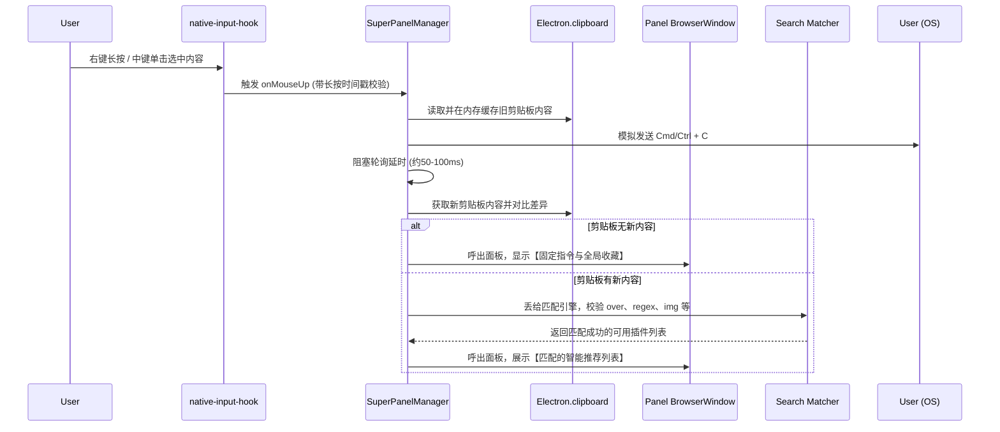

# Mulby 超级面板 (Super Panel) 设计方案

## 1. 背景与目标

参考 ZTools 乃至 uTools 的交互体验，**超级面板 (Super Panel)** 旨在通过鼠标快捷键（如中键单击、右键长按等）迅速捕获用户在任意界面选中的文本、文件或图片。
一旦捕获成功，就在鼠标位置原地弹出一个轻量级的工具面板，展示能够吞吐该类型数据的指令选项（涉及 `over` 匹配、正则表达式 `regex` 匹配、`img` 和 `files` 等指令）。

**核心目标：**
1. 实现无感知的“选中 -> 呼出 -> 处理”工作流，不再需要 “Ctrl+C -> 呼出主程序 -> Ctrl+V”。
2. 基于 Mulby 现有的技术栈与核心匹配引擎，做到最小侵入、最高性能。

---

## 2. 现有技术盘点与选型

通过对 Mulby 源码的调研，我们已有非常优秀的底层积淀，方案可以直接落地，无需引入巨大的原生模块：

1. **鼠标事件监听**：在 `src/main/services/native-input-hook.ts` 中，我们已经通过 `koffi` 实现了一套非常优雅的跨平台底层钩子（Windows `SetWindowsHookEx`，macOS `CGEventTap`，Linux `evdev`）。这可以直接被用来监听鼠标动作。
2. **键盘模拟（用于静默复制）**：在 `src/main/plugin/input.ts` 中，包含了 `simulateKeyboardTapInternal`，支持通过 `osascript/powershell/xdotool` 来发送操作。
3. **匹配引擎**：在 `src/shared/search-matcher.ts` 中，已存在完善的 `over` 和 `regex` 后端匹配逻辑。

---

## 3. 核心架构设计

我们将在主进程引入一个新的服务核心 `SuperPanelManager`，负责调度整个生命周期。

### 3.1 模块分发图



---

## 4. 落地实施细节 (Best Practices)

### 4.1. 鼠标手势与阈值判断 (Native Hook 结合层)
**问题：** 用户日常右键唤出菜单，如何区分普通的“右击”和“超级面板右击长按”？
**方案：** 
在 `NativeInputHookCallbacks` 中同时监听 `onMouseDown` 和 `onMouseUp`。
- 记录 `onMouseDown` 的时间戳，当 `onMouseUp` 触发时，若 `(upTime - downTime) > settings.longPressMs` (如 500ms)，触发静默复制流。
- 如果短时间松开，忽略处理（放行原生的右键菜单）。

### 4.2. 静默取词（复制）的优化坑点
**当前 Mulby 隐患：** 
目前 `src/main/plugin/input.ts` 中的 `simulateKeyboardTapInternal` 是基于外部脚本 (osascript / powershell) 的，每次调用大概会有 `150ms ~ 300ms` 的进程启动延迟。这对原本需要做到“丝滑呼出”的超级面板而言有些致命。
**最佳实践：** 
鉴于我们已经引入了 `koffi`，强烈建议在此阶段**复用 koffi 的 FFI 能力，实现一套零延迟的 C 级别按键模拟API**：
- **Win32**: `user32.dll` 中的 `SendInput`。
- **macOS**: `CoreGraphics.framework` 中的 `CGEventCreateKeyboardEvent` 和 `CGEventPost`。
- 这是极其关键的一步优化，能让超级面板的弹窗速度做到 50ms 内的“瞬发”。

### 4.3. 剪贴板污染与恢复 (隔离用户数据)
**最佳实践：**
- 当用户触发超级面板后，我们提取剪贴板，如果用户最终点击了“翻译”面板，任务完成；但此时用户的剪贴板已经被我们模拟的 `Ctrl+C` 覆盖。
- 应当在使用完毕或超级面板关闭（`blur`）时，判断如果在呼出之前原本的剪贴板有价值（原格式文本或图片），尽可能通过 `clipboard.write()` 恢复原样，**做到零感知静默处理**。

### 4.4. 窗口呈现方案 (UI Window)
超级面板在 UI 呈现上需要完全剥离掉主脑窗口的逻辑，它应当是一个单独加载极简 HTML/React 根节点的 `BrowserWindow`。
**配置要点**：
```typescript
{
  width: 250,
  height: 400, // 高度应根据推荐条目数量动态算出一个 max-height
  frame: false,
  transparent: true,      // 配合 macOS 毛玻璃与自定义圆角
  alwaysOnTop: true,
  skipTaskbar: true,      // 不要在任务栏留下图标
  resizable: false,
  type: process.platform === 'darwin' ? 'panel' : 'toolbar',
  webPreferences: { preload: /* ... */ }
}
```
**边界计算**：需要使用 `screen.getCursorScreenPoint()` 以及 `screen.getDisplayNearestPoint()`，防止鼠标在屏幕极右或左下角时，面板溢界截断。

### 4.5. 护城河：进程与应用的黑名单
**痛点：** 绝大多数 IDE 中中键用于关闭标签页；部分游戏内右键长按用于瞄准。
**方案：** 
每次触发鼠标钩子前，调用现成的 `ActiveWindow` 服务（依靠 koffi）。如果抛过来的 `bundleId` (Mac) 或 `app 名称` (Win) 存在于“超级面板屏蔽列表”（`blockedApps`）中，直接 `return` 阻断全流程，不发出模拟按键影响正常作业。

---

## 5. 总结：下一步开发建议

要将本方案完整落地到 Mulby，建议采取三步走的渐进策略：
1. **基础设施补齐**：利用 `koffi` 将 `Ctrl+C` 按键模拟重构为 Native 的零延时调用。
2. **逻辑控制器封装**：创建 `super-panel-manager.ts`，打通【鼠标捕捉 -> Native 取值 -> 对比并回执剪贴板 -> 搜索匹配】骨干。
3. **UI实现与连调**：新增独立的 `SuperPanelView.tsx`，与目前项目内现有的 React 与 TailwindCSS 基础设施整合，通过 IPC 显示 `over` 和 `img` 推荐指令。
